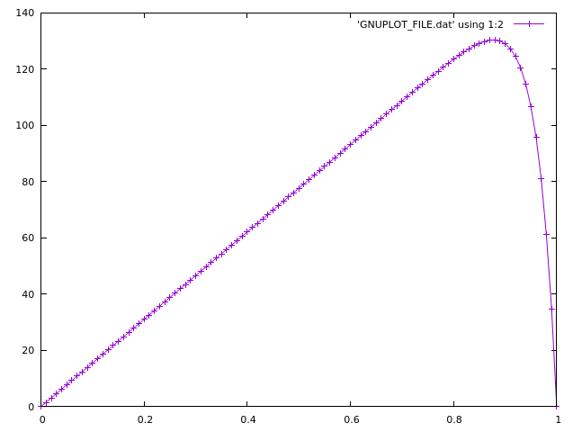

# 1D - Parallel Finite Element for Linear Problems
===================================================

An overall 1 Dimensional Finite Element Code was developed in C++. 


## Modules Available
---


-   Meshing

-   Finite Element Functions

-   Numerical Quadrature Rules

-   Boundary Condition Implementation

-   Solver

-   Post Processing

###  Meshing Module  

This Module generates the mesh required for the 1D data structure for
all order of conforming finite element Spaces. This module maintains
information like the Domain Connectivity , Local to Global DOF mapping
and other mesh parameters like node numbering , number of DOF etc. This
module can generate only Conforming Finite elements which will be passed
to the Finite Element Module.

### Finite Element Module

The finite element module includes the functions which stores the lagrange basis functions. The Reference transformation is used to avoid multiple computations of basis functions and its derivatives on the quadrature points. i.e Once the quadrature rule is fixed, then evaluate the basis function and the derivatives at the quadrature point once on the refernce cell and use Determinant of the Jacobian ( transformation matrix ) to convert it into the actual cell.

### Boundary Condition  

This Module applies the Boundary Condition either Dirichlet or Neumann
at the boundary nodes. Further, It also has parameter to apply Boundary
condition without the loss of symmetricity so that it could solved
easily using Iterative Solvers like Conjugate Gradient method

### Solver 

Direct Solver (UMFPACK - Sparse Matrix Solver Routines ) , and Iterative
Solvers like Jacobi,SOR,restarted GMRES and restarted FOM are
implemented. All the solvers are implemented with the help of intel MKL
blas routines.

### Post Processing 

this module will generate the VTK file in order to visualise the
result.Further GNU plot support is also added for easy visualisation of the result.


## Compilation Instructions
---

**needs intel c++ compilers and intel mkl libraries for operation** They can be installed from `intel oneapi basekit` `intel oneapi hpckit`


Clone the code into your system using `git clone`

1. Update the UserConfig.cmake file in the root folder for any changes


2. Create the build directory on the root folder

```
mkdir build
cd build
```

3. Create the executable by running cmake and make

```
cmake ../
make -j2
```

4. Then Copy the `file.txt` from the Input folder to the build folder

```
cp ../Input/file.txt .
```

Change the parameters in the file.txt if necessary

5. The run the executable using 

```
./prob1 file.txt
```

### Sample Output Images




```
-------------- Meshing ----------------
No of Nodes : 2
FE order    : 1
No of Cells : 100
-------------- Meshing [Completed] ----------------
-------------- Setting Up FE System ----------------
 The Quadrature Rule Selected is 2
 Sparsity Pattern Set for Matrix 
 Matrix Initialisation Completed 
 Values initiated at quadrature points
 Values initiated for Det J
-------------- Setting Up FE System [ COMPLETED ]----------------
 N_DOF    : 101
 NNZ      : 301
 Sparsity : 0.970493
---------- Assembly Started --------------- 
 Assembly Type : Normal
 Time Taken for assembly : 0.011 ms
 ----------------- Assembly [Completed] -------------------- 
 Boubdary Condition Type : Normal
 Solver : Jacobi BLAS
 Relaxation Parameter :  0.5
 Iteration : 100 Error Norm : 0.935945
 Iteration : 200 Error Norm : 0.881926
 Iteration : 300 Error Norm : 0.830447
 Iteration : 400 Error Norm : 0.778257
 Iteration : 500 Error Norm : 0.723882
 Iteration : 600 Error Norm : 0.666228
 Iteration : 700 Error Norm : 0.604419
 Iteration : 800 Error Norm : 0.538204
 Iteration : 900 Error Norm : 0.468489
 Iteration : 1000 Error Norm : 0.397487
 Iteration : 1100 Error Norm : 0.328254
 Iteration : 1200 Error Norm : 0.263869
 Iteration : 1300 Error Norm : 0.206715
 Iteration : 1400 Error Norm : 0.158114
 Iteration : 1500 Error Norm : 0.11834
 Iteration : 1600 Error Norm : 0.0868625
 Iteration : 1700 Error Norm : 0.0626643
 Iteration : 1800 Error Norm : 0.0445212
 Iteration : 1900 Error Norm : 0.0312074
 Iteration : 2000 Error Norm : 0.0216169
 Iteration : 2100 Error Norm : 0.0148178
 Iteration : 2200 Error Norm : 0.0100641
 Iteration : 2300 Error Norm : 0.00677991
 Iteration : 2400 Error Norm : 0.00453468
 Iteration : 2500 Error Norm : 11.6586
 Iteration : 2600 Error Norm : 7.70392
 Iteration : 2700 Error Norm : 5.06507
 Iteration : 2800 Error Norm : 3.31517
 Iteration : 2900 Error Norm : 2.16113
 Iteration : 3000 Error Norm : 1.40375
 Iteration : 3100 Error Norm : 0.908859
 Iteration : 3200 Error Norm : 0.586733
 Iteration : 3300 Error Norm : 0.377787
 Iteration : 3400 Error Norm : 0.242676
 Iteration : 3500 Error Norm : 0.155553
 Iteration : 3600 Error Norm : 0.0995158
 Iteration : 3700 Error Norm : 0.063554
 Iteration : 3800 Error Norm : 0.0405231
 Iteration : 3900 Error Norm : 0.0258008
 Iteration : 4000 Error Norm : 0.0164055
 Iteration : 4100 Error Norm : 0.010419
 Iteration : 4200 Error Norm : 0.00660976
 Iteration : 4300 Error Norm : 0.004189
 Iteration : 4400 Error Norm : 0.00265238
 Iteration : 4500 Error Norm : 0.00167803
 Iteration : 4600 Error Norm : 0.00106078
 Iteration : 4700 Error Norm : 0.000670116
 Iteration : 4800 Error Norm : 0.00042305
 Iteration : 4900 Error Norm : 0.000266916
 Iteration : 5000 Error Norm : 0.000168315
 Iteration : 5100 Error Norm : 0.000106084
 Iteration : 5200 Error Norm : 6.6831e-05
 Iteration : 5300 Error Norm : 4.20844e-05
 Iteration : 5400 Error Norm : 2.64907e-05
 Iteration : 5500 Error Norm : 1.6669e-05
 Iteration : 5600 Error Norm : 1.04853e-05
 Status :  Jacobi Iteration has converged    
  Total Iterations  :  5611
  Total Time taken  :  0.04584 sec
  Error Norm        :  9.96385e-06
 ------------------------------------------------------------------
VTK File sol.vtk has been generated
```


### GNU Plot Visualisation

